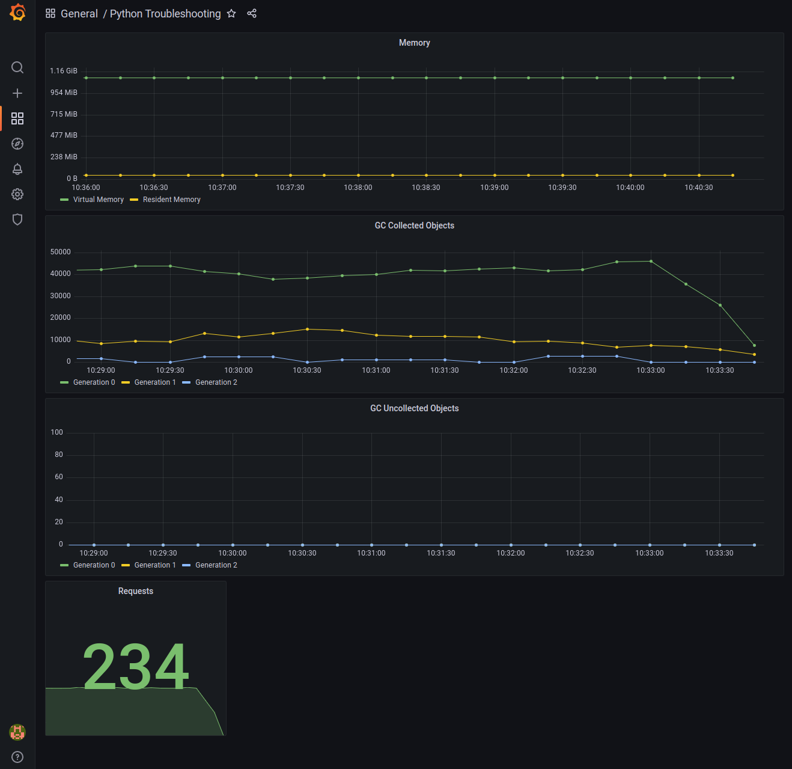
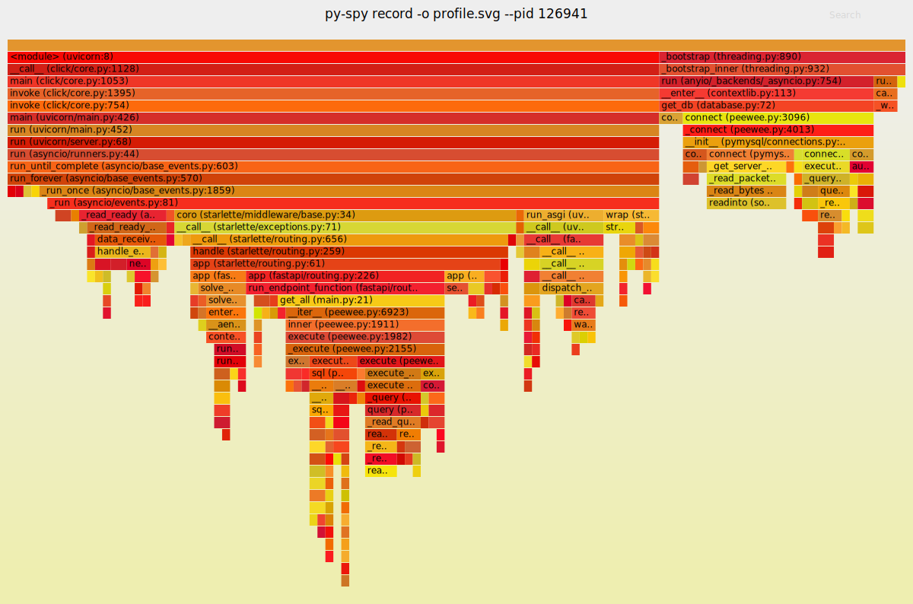

# Troubleshooting Python

### Preparação do ambiente

```sh
python3 -m venv  ./.venv
pip install -r requirements.txt
docker-compose up --build
# If you need run local
uvicorn --host 0.0.0.0 --port 80 --workers 5 main:app
```

Importar **grafana-dashboard.json** no Grafana.



### Run performance tests

[Install k6](https://k6.io/docs/getting-started/installation/)

```sh
k6 run k6/k6-get-script.js
```

### Profile memory

```sh
# Find process number
ps -aux | grep python
# Top memory functions
sudo env "PATH=$PATH" py-spy top --pid 126941
# Flame graph
sudo env "PATH=$PATH" py-spy record -o images/profile.svg --pid 126941
```



### Links

| App         | Url                           | User  | Password |
|-------------|-------------------------------|-------|----------|
| prometheus  | <http://localhost:9090>         |       |          |
| grafana     | <http://localhost:3000>         | admin | admin    |
| app         | <http://localhost:80>           |       |          |
| app-docker  | <http://localhost:8000>         |       |          |
| app-metrics | <http://localhost:8000/metrics> |       |          |
|             |                               |       |          |
